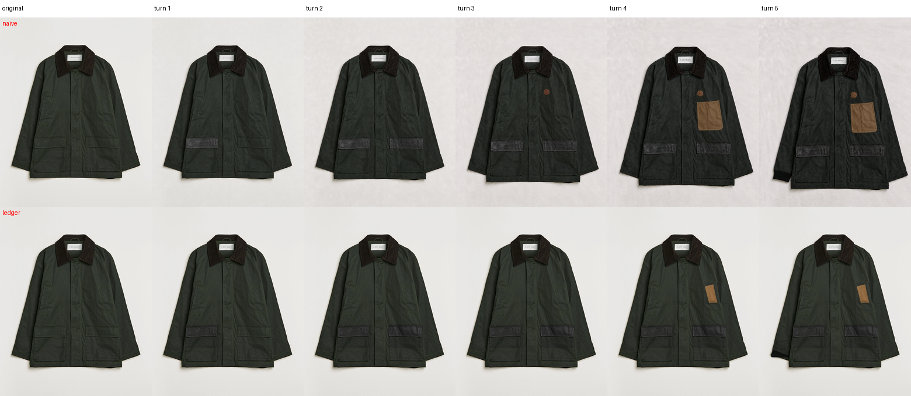
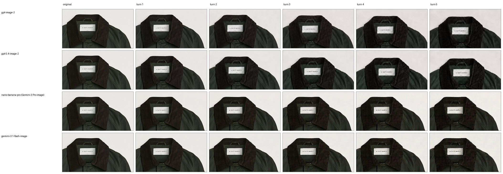
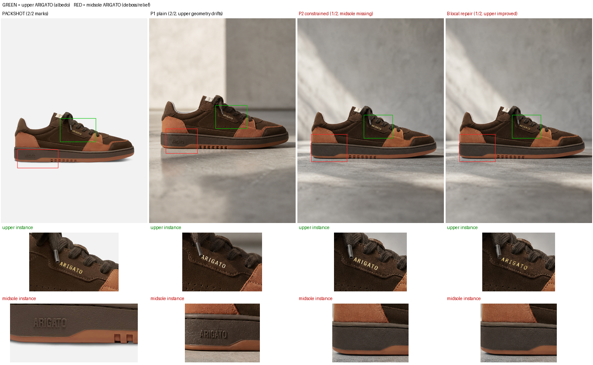
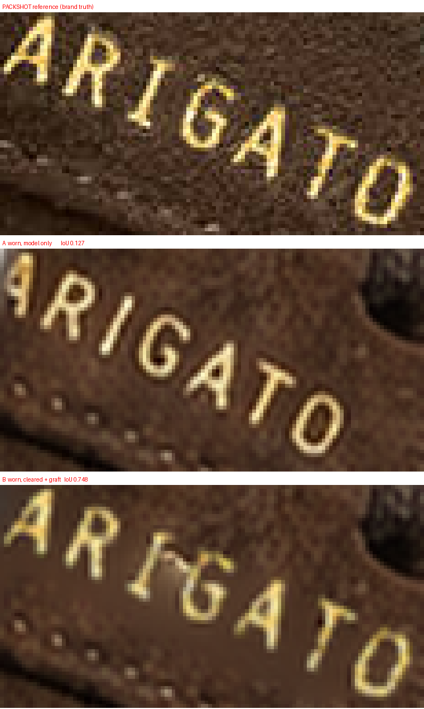
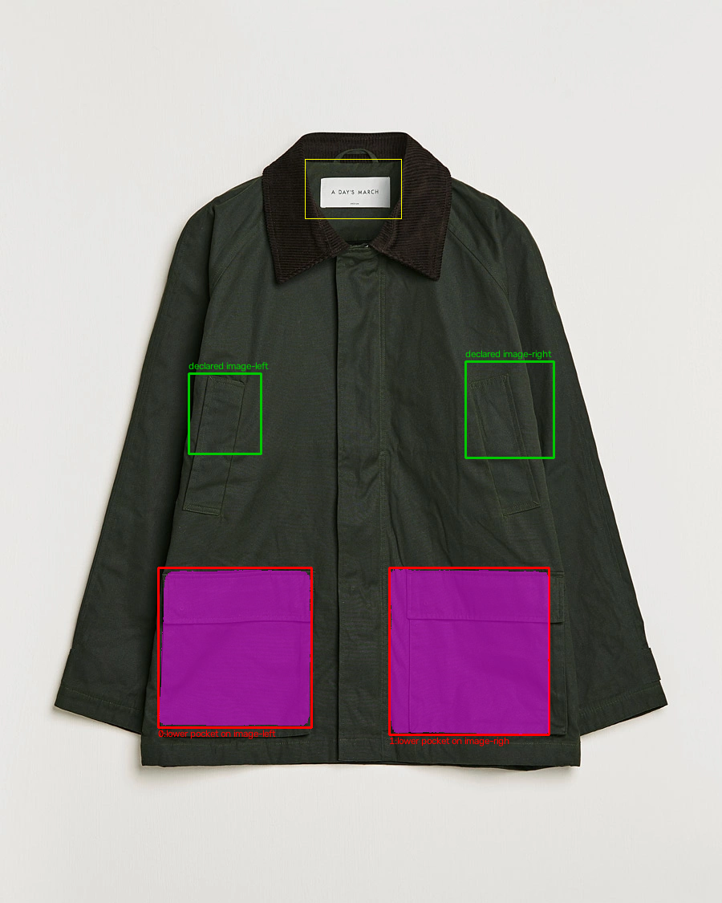

# Constraint-preserving black-box image workflows
### Tasks 1 (Garment Consistency) and 4 (Edit Degradation)

**Models:** four black-box image editors from OpenAI and Google via OpenRouter; no fine-tuning.  
**Scope:** Task 4 has one five-edit naive chain per editor; Task 1 has two footwear cases, a product
shot and a worn shot; no replicates.  
**Cost:** the provider account charged **$3.8512** across all activity on the key, including smoke
tests, four paired Task 4 runs and aborted/failed calls, so I claim no experiment-specific invoice.
Our own price table runs **9.3% low** against it ([receipt](weon-pipeline/outputs/actual_cost.json)).  
**Code/evidence:** `weon-pipeline/`; 45 offline tests; headline values have saved JSON and images.

## 1. Decision summary

The experiments suggest a bounded operational rule:

> **Keep protected state outside the model's mutable representation. Your preservation and your
> scoring reach exactly as far as the constraint inventory you declared.**

```text
Task 4: predeclared support -> crop candidate -> Gate v1 -> hard commit / rollback
Task 1: generated shot -> identity inventory -> declared repair placement -> review
```

Headline results:

| Finding | Result | Meaning |
|---|---:|---|
| Destroyed-ROI evaluation control | old SSIM **0.921626** -> corrected **0.000004** | I fixed the measurement before optimising against it |
| Task 4 protected label after one naive edit | **0.25–0.62%** byte-identical across four editors | full-frame rerendering rewrote over 99% of label pixels |
| Task 1 upper wordmark repair, product shot | stroke IoU **0.213 -> 0.670** | local geometry improved; full-product consistency did not |
| Same repair, **worn** shot (§5) | stroke IoU **0.127 -> 0.749** | the model scores lower on the worn shot; the repair scores higher |
| Spelling vs geometry on the same pixels (§5) | text **PASS**, IoU **0.1268 FAIL** -> **REJECTED** | one score would have averaged these into a meaningless number |
| Relief mark the pixel metric failed on (§5) | VLM reads it: **PASS** on both worn shots, clean on a blank control | the two material modes need different *instruments*, not just renderers |
| Automatic locator (§6) | **2 of 4** pockets, **0 px** overlap with either chest reading | it returns no signal of the omission; supports stay hand-declared |

Two declaration failures showed up in concrete form. One Task 4 support ran broader than the pocket
it named, and Task 1's automated check covered one of two wordmarks. Neither check could score what
its declared scope left out.

## 2. Evaluation and failure analysis

The original masked SSIM zeroed pixels outside the mask, so identical black regions hid a destroyed
target. The correction evaluates the ROI alone and adds PSNR and byte-exact percentage; dry runs
report N/A. See the [regression](weon-pipeline/tests/test_metrics.py) and
[receipt](weon-pipeline/outputs/eval_receipt.json).

Instruction success, preservation, boundary quality and naturalness remain separate, matching the
decoupled, human-checked direction of
[I2I-Bench](https://openaccess.thecvf.com/content/CVPR2026/html/Wang_I2I-Bench_A_Comprehensive_Benchmark_Suite_for_Image-to-Image_Editing_Models_CVPR_2026_paper.html)
and the [OpenVTON-Bench preprint](https://arxiv.org/abs/2601.22725).

Observed failure taxonomy:

| Task | Failure | Evidence |
|---|---|---|
| 4 | global rerender drift | untouched label and texture change after one edit |
| 4 | grounding / mask-shape bias | a rectangular support produces a rectangular-looking edit |
| 4 | silent locator omission | 2 of 4 pockets returned in well-formed JSON, with no signal of incompleteness |
| 1 | correct text, wrong brand geometry | both generations spell ARIGATO but use heavier letterforms |
| 1 | a passing check on a failing mark | spelling PASS at stroke IoU 0.1268: correct string, wrong mark |
| 1 | incomplete identity inventory | constrained generation lacks a second, debossed ARIGATO mark |
| 1 | representation risk (hypothesis) | residual probes suggest albedo and relief need different renderers |

## 3. Task 4 — edit ledger and cross-editor stress test

I chained five instructions on one jacket. The naive arm rerenders the whole previous frame; the
ledger edits a crop and commits inside a predeclared support. This end-to-end comparison also
changes field of view, effective scale and context, so it is not a single-variable ablation.

| editor | naive label SSIM t1 → t5 | exact t1 | Gate-v1 commits | wall / configured estimate |
|---|---:|---:|---:|---:|
| `gpt-image-2` | 0.555 → 0.131 | 0.62% | 4/5 | 662 s / $0.80 |
| `gpt-5.4-image-2` | 0.403 → 0.165 | 0.38% | incomplete* | 411 s / $0.21 |
| `nano-banana-pro` (Gemini 3 Pro image) | 0.886 → 0.763 | 0.28% | 3/5 | 211 s / $1.50 |
| `gemini-3.1-flash-image` | 0.885 → 0.757 | 0.25% | 3/5 | 129 s / $0.60 |



For the main run, Gate v1 rejected turn 3 at context SSIM `0.545 < 0.60`; rollback left the
canonical image unchanged. The ledger's 100% exterior equality follows from the architecture: the
ledger copies pixels outside the declared support forward. The empirical outcome is 4/5 commits.

The main run's broad metric used inconsistent unions after rejection; the corrected
[receipt](weon-pipeline/outputs/task4/common_union_recompute.json) uses all attempted supports and
leaves the label result unchanged. Its [resize control](weon-pipeline/outputs/task4/resample_control.json)
lost `0.018` SSIM at worst against `0.445` observed, which excludes those resize paths rather than
the full set of harness effects. See the full [curve](weon-pipeline/outputs/task4/task4_curve.png).



All four sampled naive runs changed over 99% of protected-label pixels. In this case the OpenAI
outputs changed scale/placement, while the Google outputs stayed aligned and changed letterforms in
ways legible at 8× zoom; this is not a vendor rule or ranking. SSIM therefore cannot certify text
identity: at nano turn 5 it reads `0.7634` at `0.0113%` byte-equality, which detects the drift but
cannot say the failure is *spelling*. A specialist later transcribed that same crop as
`A DATT MARCH` (§5). The [receipt and hashes](weon-pipeline/outputs/task4/model_comparison_4x.json)
make the saved comparison auditable. The `gpt-5.4-image-2` naive chain completed, but three ledger
turns had network errors, so I excluded that ledger arm.

Direction 2 was an offline three-zone commit: an 8 px inward collar reduced the within-box seam
diagnostic `34.101 → 21.669`, retained 94.14% of candidate delta and kept the exterior exact. A
post-hoc polygon changed the footprint more, consistent with [mask-shape bias](https://arxiv.org/abs/2605.07846),
but is not ground truth. One hypothesis-aware author answered **YES** to turn 4; without a calibrated
shape/material check, semantics remain unresolved. Gate v2 is postmortem only.

With one candidate the ledger adds no generation call; retries or semantic review can add cost.

## 4. Task 1 — local repair versus product completeness

Direction 1 compared a plain prompt with tight reference conditioning. Both outputs spell ARIGATO
but restyle its serif geometry; p1 has no persisted IoU, and I did not test OCR. A spelling-only
judgment would accept both: **geometry carries the brand identity that spelling cannot.** Direction
2 clears the generated upper mark and applies a reference-derived repair.

| condition | stroke IoU ↑ | ink-area ratio | mark ΔE ↓ | prototype decision |
|---|---:|---:|---:|---|
| A: model output | 0.213 | 1.056 | 6.03 | reject geometry |
| B: cleared + graft | **0.670** | 1.008 | 8.15 | review |
| C: supersampled + relit | 0.511 | 1.391 | **43.17** | reject colour |


These are uncalibrated diagnostics. B derives from the reference asset through a warp rather than a
post-warp pixel copy. B versus C changes supersampling and relighting together, so it supports no
causal claim about relighting. The [receipt](weon-pipeline/outputs/task1/task1_compare.json) records
all checks.

The two-instance wordmark audit changed the conclusion. The packshot and plain generation contain two
ARIGATO instances: a gold upper wordmark and debossed midsole wordmark. The constrained generation
lacks the midsole instance; A/B/C inherit that input. The repair improved the remaining upper mark
and did not cause the omission. The phrase `no other text` may have contributed, but changed
references and one stochastic sample prevent causal attribution.



Local IoU improved while the result still had one of two expected wordmarks. A future full
**identity manifest** should record counts, placement and material mode for logos, prints, closures
and structural details before per-instance checks.

An offline probe compared the ARIGATO foil crop with a separate Beyond Nordic tonal-embroidery
crop. It motivates material-specific routing but does not measure the missing midsole deboss, and I
implemented no relief renderer.

One hypothesis-aware author accepted B in a condition-label-hidden presentation; it is a sanity
check at n=1. A VLM configuration scored 0% on the known-answer fidelity control, and I did not
promote it to a gate. The two Task 1 calls took 99.9 s and cost $0.16 by the configured table; repair
and evaluation ran offline.

## 5. Task 1 — the worn case, and a specialist that disagrees with itself

The product-shot case above answers an easier question than the brief asks. The brief's product is a
model *wearing* the garment, which changes pose, scale, lighting and occlusion at once. I declared
the [manifest](weon-pipeline/cases/task1_worn.py) before generating: six identity attributes, both
ARIGATO instances, each marked with whether this pipeline can check it. The code enforced an attempt
budget of **2**. Both attempts were usable; both retained both marks.

| | model only | cleared + graft | gain |
|---|---:|---:|---:|
| product shot | 0.2127 | 0.6705 | +0.458 |
| **worn shot** | **0.1268** | **0.7485** | **+0.622** |

The repair transfers, and the gain is larger on the harder case. The model scores lower when the
shoe is worn (0.213 → 0.127); the deterministic repair scores higher (0.670 → 0.749). The worn mark
is ~74×36 px against ~79×37 in the product shot, so this is not a resolution advantage.



`brand_text` had returned UNKNOWN in each certificate. An UNKNOWN names the specialist that is
missing, so we built it under **open transcription**: the expected string stays out of the prompt,
and the comparison happens in code. Four known-answer controls, 3 repeats,
[4/4 as specified](weon-pipeline/outputs/spelling/spelling.json): it reads a clean label, transcribes
the real nano corruption as `A DATT MARCH`, answers `UNREADABLE` on a crop whose legibility I
destroyed instead of guessing a brand it had read twice before, and passes a re-lettered mark that
spells ARIGATO. Four inputs make a probe rather than a calibration. It licenses wiring this check
into this case. It licenses no claim about general OCR accuracy.

The fourth control carries the argument. On the model's own worn output the
[certificate](weon-pipeline/outputs/task1_worn/worn_certificate.json) reads:

```text
A_model_only
   brand_text                 pass     transcribed 'ARIGATO' == expected
   mark_colour                pass     mark colour dE 6.44
   mark_geometry              fail     stroke IoU 0.1268 vs the brand mark
   photographic_naturalness   unknown  no calibrated specialist; routes to human review
   -> REJECTED
```

Three checks pass and the gate rejects it anyway. The mark says ARIGATO and is not the ARIGATO mark.
Both verdicts hold on the same pixels. Spelling certifies the string and geometry certifies the
identity; a blended score would average them into a number that carries neither. `B_cleared_graft`
returns **review**: naturalness stays UNKNOWN, which blocks an automatic commit.

The manifest's second ARIGATO — debossed into the midsole, the same colour as its substrate — was
declared and unscored: the earlier automatic detector ranked a blank band above one that visibly
reads ARIGATO. That detector keyed on colour and luminance structure, and a relief mark carries
almost none; it is shading, not albedo. A VLM reads shape instead, so I put the same specialist on
it ([receipt](weon-pipeline/outputs/midsole/midsole.json), 12 calls, controls first):

| crop | expected | observed |
|---|---|---|
| the brand's own packshot deboss | PASS | PASS, `ARIGATO` |
| **blank midsole rubber** | UNKNOWN | UNKNOWN, `UNREADABLE` |
| a1 midsole | — | **PASS**, `ARIGATO` |
| a2 midsole | — | **PASS**, `ARIGATO` |

The blank-substrate control is the one that matters: it is the input class that broke the previous
detector, and the specialist did **not** hallucinate the brand onto empty rubber. So the row is
scored — **the relief instance survives in both worn generations**, and the tool that reads it is
the one that ignores colour. That is the sharpest support the albedo-versus-relief split has: the
two material modes did not just need different *renderers*, they needed different *instruments*.

The check certifies **presence, never absence**: a transcription that reads nothing has failed to
find a mark, which is not proof there is none. Four crops remain a probe. The certificate above
predates this probe and still records `midsole_instance: UNKNOWN`; the resolution is the receipt.

## 6. Grounding: the locator omits, silently

I declared each support by hand. That holds up for five known edits and fails at scale, so the
load-bearing question is whether a VLM can supply them. The question *"where is the right chest
pocket?"* gets a box back whether or not the model found one; that earlier form put the box near the
**centre placket**, `0 px` against *both* declared chest boxes at ~6.2× their area. So we asked it to
**enumerate every pocket** instead, with no count supplied, and scored against both readings of
"right" (on a flat-lay the wearer's right chest pocket appears image-left).

The jacket has four pockets. It returned **two**, both lower flaps, with accurate masks, and left out
both chest welts. The welts were absent from the response rather than mislocated within it. Both
declared boxes contain a
[real, visible welt opening](weon-pipeline/outputs/grounding/missed_pockets_verification.png), so the
declarations were accurate.



The response is confident, well-formed JSON with correct labels. **Nothing in it signals
incompleteness.** This is the silent-omission failure mode that the project exists to catch. It also
explains the placket answer: forced to name a pocket it cannot see, the model invents; allowed to
enumerate, it omits.

So I did not run the planned re-composition of the already-paid turn-4 candidate. Its precondition,
verified localization, failed, and re-compositing through an unverified region would polish a
mistake, the same error the collar ablation identified. One image, one grounder, one prompt. This
blocks my automation and does not benchmark Gemini.

## 7. Limits and next work

- `n=1` chain per editor; two Task 1 cases (product shot, worn), one generation each, no replicates.
- I declared supports and placement by hand, and §6 measures why they stay that way.
- I declared the worn quad by hand off a coordinate grid. Locating it from the model's own re-drawn
  mark would make the measurement circular. B is reference-*derived*, so the warp leaves it 0%
  bit-exact against the reference.
- The spelling specialist is a 4-input probe. No threshold, brand, font or resolution generalises.
- I set the thresholds (IoU 0.35, SSIM 0.60, dE 25) by hand and did not calibrate them.
- The midsole relief mark is scored for **presence only** (§5), on 4 crops, by a VLM rather than a
  pixel metric. The check cannot prove absence, and the pixel-metric detector for it stays broken.
- Exact exterior preservation applies to local edits with correct supports. It does not extend to
  relighting or background replacement, and drift inside the support remains.
- Human evidence is an author pilot at n=1.

Next experiments:

1. **Grounding, now the largest known dependency rather than an assumption** (§6): stronger
   segmentation, and an enumeration check that can report its own incompleteness.
2. Extend the specialist pattern to the two remaining UNKNOWNs, naturalness and relief presence,
   each with failure controls before use, as in §5.
3. Add material-aware rendering for print/albedo versus embroidery/deboss/relief.
4. Evaluate 5–15 cases spanning plain, printed, structured and layered garments, reporting
   preservation, instruction success, integration, coverage, latency and cost separately.

Reproduction commands and artifact locations are in the
[README](weon-pipeline/README.md).
